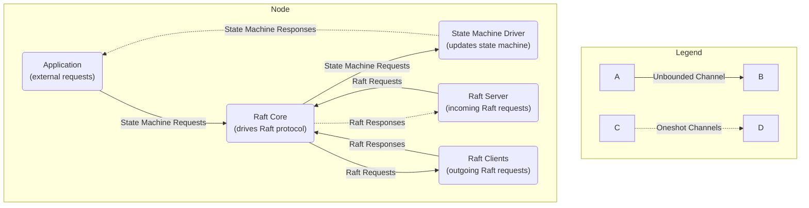

# Raft Architecture

# Components

## Raft Core

The raft core is a single task (ie, a single thread) that drives the Raft protocol.

It manages all the Raft-specific state and logic, like term numbers, voting, log replication, etc.

The raft core has a single queue for incoming interactions with other components, including:

- Raft requests from other nodes
- Raft responses from other nodes
- State machine requests from the application

The raft core also manages its own timers, deciding when to send heartbeats, when to start elections, etc.

## Raft Server

The raft server handles incoming Raft GRPC requests from other nodes.

It forwards these requests to the core, and gets responses back on oneshot channels.

The tonic server is typically multithreaded, but the core's queue will serialize requests.

## Raft Clients

The raft client component is responsible for sending Raft GRPC requests to other nodes.

It maintains a GRPC client for each other node in the cluster, and handles reconnecting if the connection is lost.

Spawns a new task for each outgoing request, and sends back responses back to the core via its queue.

Since the raft protocol is robust to failures, the client doesn't even inform the core of request failures.

## State Machine Driver

The state machine driver is a single task (ie, a single thread) responsible for applying log entries to the state
machine.

When a log entry has been committed, the core queues up the command to be applied to the state machine.

The core also forwards the response channel to the state machine driver so that it can respond to the
application directly.

